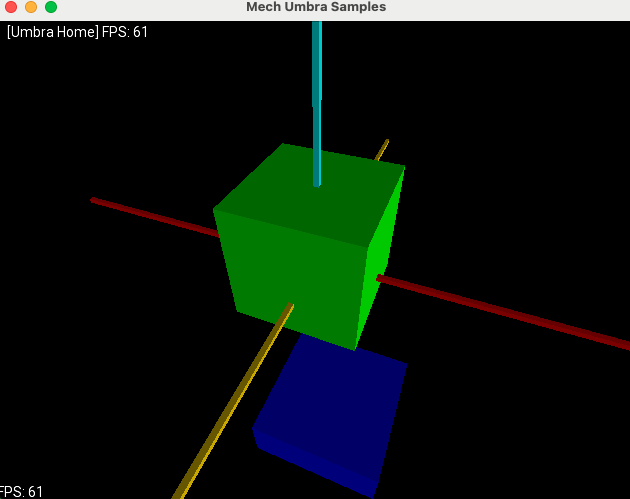
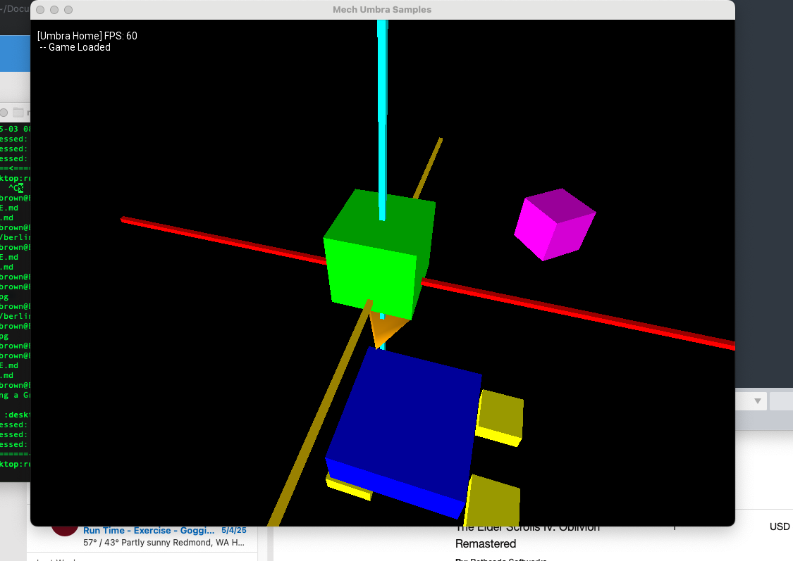

# mechumbra-samples

Mech Game Sample Setup Strategy

## Basic Libgdx Examples

Show various OpenGL and libgdx examples, camera movement, etc

## On Libgdx

LibGDX is an open-source, cross-platform game development framework that lets you write your game once in Java and deploy it across desktop, Android, iOS, and web platforms.  It has components for graphics, audio, input, and physics, LibGDX gives you everything you need to build a complete game.

## Example Scene Screenshots

## Additional Links

https://www.opengl.org/

https://libgdx.com/

https://github.com/BSVogler/WurfelEngineSDK/

https://github.com/BSVogler/Caveland